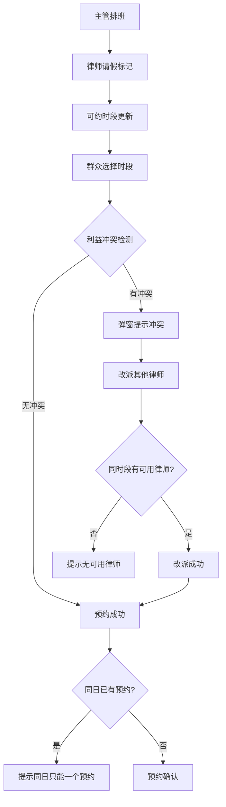

## 1. 产品概述

法律咨询中心排班与预约管理系统，面向值班主管、律师、群众和现场工作人员，提供律师排班、群众预约、请假处理和利益冲突改派的全流程闭环操作。目标是用本地数据完整支撑一轮"排班→预约→请假→冲突改派"的业务演示。

## 2. 核心功能

### 2.1 用户角色

| 角色 | 进入方式 | 核心权限 |
|------|----------|----------|
| 值班主管 | 角色切换入口 | 排班管理、请假审批、冲突改派 |
| 律师 | 角色切换入口 | 查看自己排班、提交请假 |
| 群众 | 角色切换入口 | 按时段预约、查看预约详情 |
| 现场人员 | 角色切换入口 | 处理临时冲突、改派律师 |

### 2.2 功能模块

1. **排班日历页**：日历视图展示律师排班、请假标记、可约时段
2. **预约详情页**：群众选择时段预约、查看/取消预约、同一天唯一约束
3. **冲突处理页**：利益冲突检测提示、律师改派操作、改派记录

### 2.3 页面详情

| 页面名称 | 模块名称 | 功能描述 |
|----------|----------|----------|
| 排班日历页 | 月历视图 | 按月展示律师排班状态，请假时段灰显，可约时段高亮 |
| 排班日历页 | 排班编辑面板 | 主管点击日期为律师分配时段（上午/下午/全天） |
| 排班日历页 | 请假标记 | 律师请假后对应时段自动从可约列表移除 |
| 预约详情页 | 时段选择器 | 群众查看可约律师和时段，选择预约 |
| 预约详情页 | 同日唯一校验 | 同一群众同一天只能保留一个预约，超出时提示 |
| 预约详情页 | 我的预约 | 查看已有预约，可取消 |
| 冲突处理页 | 冲突检测 | 提交预约时自动检测利益冲突，弹窗明确提示 |
| 冲突处理页 | 改派操作 | 一键改派到同时段其他可用律师 |
| 冲突处理页 | 改派记录 | 记录所有改派操作的时间、原律师、新律师 |

## 3. 核心流程

群众预约流程：群众打开日历→选择日期→查看可约律师时段→提交预约→系统检测利益冲突→如有冲突弹窗提示改派→确认预约成功。

主管排班流程：主管打开日历→选择日期→为律师分配时段→律师请假时标记请假→对应时段自动从可约列表移除。

冲突改派流程：现场人员收到冲突通知→查看冲突详情→选择同时段其他可用律师→执行改派→通知群众和律师。

## 4. 用户界面设计

### 4.1 设计风格

- 主色调：深藏青色（#1B2A4A）体现法律严肃性，辅以琥珀金（#D4A843）强调重要操作
- 按钮风格：圆角矩形，hover 时微浮起效果
- 字体：标题使用 Noto Serif SC（宋体风格），正文使用 Noto Sans SC
- 布局风格：左侧日历主导，右侧面板联动详情
- 图标风格：线性图标，与法律/日历主题一致

### 4.2 页面设计概览

| 页面名称 | 模块名称 | UI 元素 |
|----------|----------|---------|
| 排班日历页 | 月历视图 | 7列网格，日期格内显示排班律师头像和姓名缩写，请假标记红色叉号 |
| 排班日历页 | 排班编辑面板 | 右侧滑出面板，律师下拉选择，时段复选框（上午/下午） |
| 预约详情页 | 时段选择器 | 律师卡片列表，每张卡片显示律师姓名、专长、可约时段按钮 |
| 预约详情页 | 我的预约 | 预约卡片，显示日期、时段、律师、状态标签 |
| 冲突处理页 | 冲突检测弹窗 | 模态框，红色警告图标，冲突原因说明，改派律师列表 |
| 冲突处理页 | 改派记录 | 时间线样式，每条记录展示原律师→新律师，时间戳 |

### 4.3 响应式设计

- 桌面优先设计，日历和面板并排展示
- 平板端面板折叠为抽屉
- 移动端日历缩小为周视图，面板全屏展示
