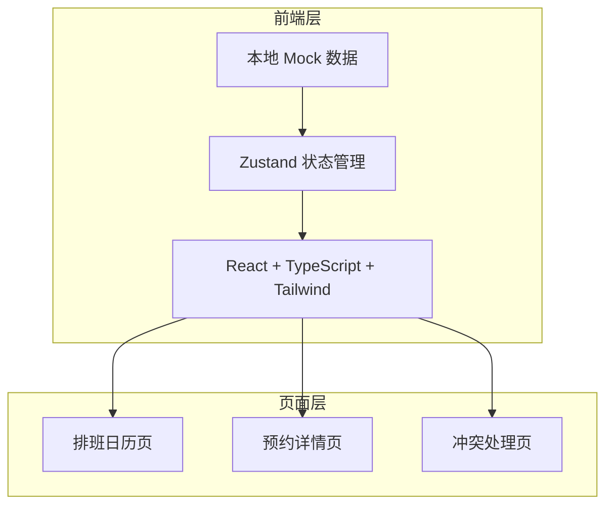
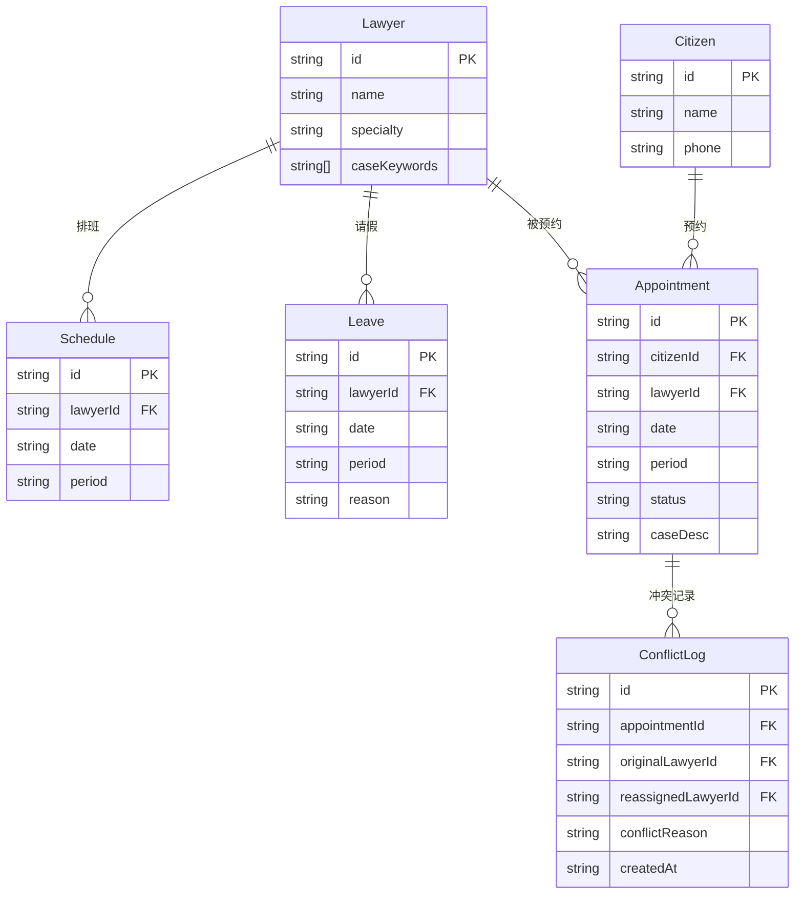

## 1. 架构设计



## 2. 技术说明

- 前端：React@18 + TypeScript + Tailwind CSS@3 + Vite
- 初始化工具：vite-init
- 后端：无（纯前端，本地数据）
- 数据存储：Zustand + localStorage 持久化

## 3. 路由定义

| 路由 | 用途 |
|------|------|
| / | 排班日历主页，日历视图+排班编辑 |
| /booking | 预约详情页，时段选择+我的预约 |
| /conflict | 冲突处理页，冲突检测+改派记录 |

## 4. API 定义

无真实后端 API。所有数据操作通过 Zustand store 方法完成：

```typescript
interface ScheduleStore {
  lawyers: Lawyer[]
  schedules: Schedule[]
  leaves: Leave[]
  appointments: Appointment[]
  conflicts: ConflictLog[]

  addSchedule: (schedule: Schedule) => void
  removeSchedule: (id: string) => void
  addLeave: (leave: Leave) => void
  cancelLeave: (id: string) => void
  addAppointment: (apt: Appointment) => AppointmentResult
  cancelAppointment: (id: string) => void
  reassignAppointment: (aptId: string, newLawyerId: string) => void
  checkConflict: (citizenId: string, lawyerId: string) => ConflictInfo | null
  getAvailableSlots: (date: string) => AvailableSlot[]
}
```

## 5. 数据模型

### 5.1 数据模型定义



### 5.2 数据定义

本地 Mock 数据预置：

- 6 名律师，各有不同专长和案件关键词
- 一周的排班数据
- 2 条请假记录
- 3 条预约记录（含一条冲突记录）
- 利益冲突规则：群众案件描述关键词与律师已有案件关键词重叠即为冲突

时段定义：
- 上午：09:00 - 12:00
- 下午：14:00 - 17:00
